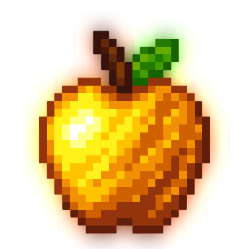

 

# 
Golden Apple

Sync your mods with a minecraft server
## About the project
This project is not completed, I have a lot of ideas to add to this project
## This project is made with
C#

VS 2022
## Social
All your files and folders are presented as a tree in the file explorer. You can switch from one to another by clicking a file in the tree.
